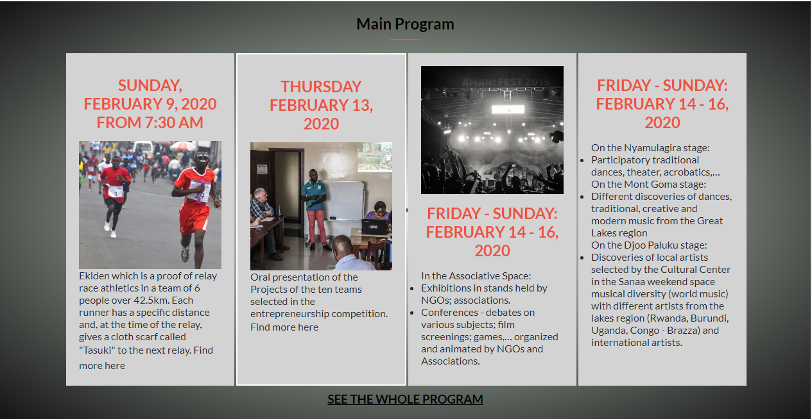

# html-css-capstone-project

# Amani festival

# What it does
This is the end Project of HTML and CSS module, I built a festival Amani website

We used 3 pages in this project
- Home : here we added the program about the festival
- About : We added the historical and the values
- Tickets : How you can get a ticket to join this event

## Screenshots

### Screenshot 1

### Screenshot 2

### Screenshot 3

## Built With
- HTML
- CSS
#### and deployed to Github

## Live Demo

[Live Demo](https://raw.githack.com/Theophile-Kango/html-css-capstone-project/feature/index.html)

## Getting Started

To get a local copy up and running follow these simple example steps.
- Clone the project unto your local machine
- `cd` into the project directory
- Open up index.html in your browser to view the project

## Author

[Github](@Theophile-Kango)

[Twitter](@Theophadh)

[Linkedin](https://www.linkedin.com/in/theophile-kango-b6b580194/)

## 🤝 Contributing

Feel free to check the [issues page](https://github.com/Theophile-Kango/html-css-capstone-project/issues/).

## Attributions and Credit
Special thanks to [Theophile Kango], The designer of this amazing web site! 

## Show your support

Give a ⭐️ if you like this project!

## 📝 License

This project is licensed by Microverse.

### Enjoy!
